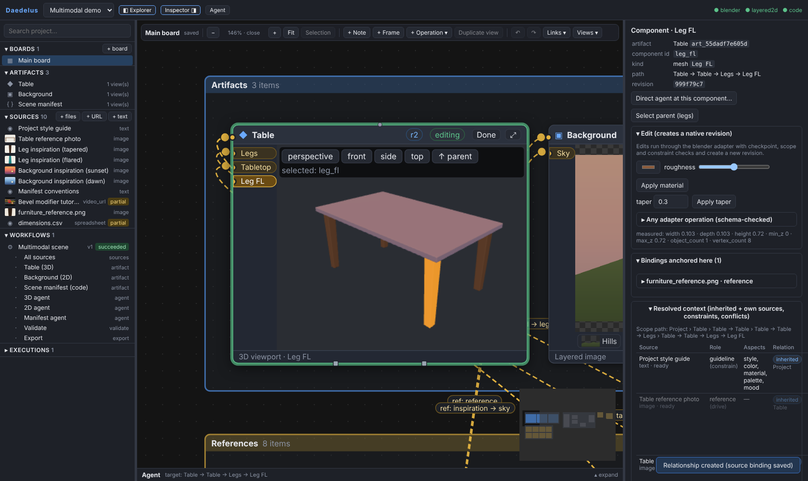

# Daedelus

Universal multimodal agentic creation studio. Users bring any mix of sources — text, images,
video files and URLs, PDFs, 3D models, code repositories — give each one or more **meanings**
(reference, inspiration, guideline, constraint, technique, evaluation… or their own roles) and
**scopes** (the whole project, one artifact, a component, a sub-component), and direct agents
through **editable workflows** that produce **real, editable artifacts** (Blender scenes,
OpenRaster layered images, git-tracked code).

Media type, meaning and scope are independent concepts. No medium, provider or pipeline is
built in as primary.

The studio is one spatial workspace: an explorer, an infinite canvas of live artifact views,
references and workflow operations, and a contextual inspector. Artifacts are edited in place
or in Focus through their native adapters.



## Layout

| Path | Contents |
|---|---|
| `backend/` | Python package `daedelus`: domain model, SQLite/filesystem store, ingestion, binding resolver, workflow engine, adapters (Blender, OpenRaster, git/code), planners (deterministic heuristic, Claude), FastAPI, CLI, demonstration scenarios, tests |
| `studio/` | React + TypeScript studio (React Flow, Three.js, Monaco); `studio/src-tauri` Tauri 2 desktop shell; `studio/e2e` Playwright walkthrough |
| `docs/` | [Architecture](docs/ARCHITECTURE.md), [V1 spatial canvas architecture](docs/V1_ARCHITECTURE.md), [V0 report](docs/V0_REPORT.md), [V1 report](docs/V1_REPORT.md), [V1.1 architecture](docs/V1_1_ARCHITECTURE.md), [V1.1 report](docs/V1_1_REPORT.md), [V1.2 architecture](docs/V1_2_ARCHITECTURE.md), [V1.2 report](docs/V1_2_REPORT.md), [V2 architecture](docs/V2_ARCHITECTURE.md), [V2 report](docs/V2_REPORT.md), [security model](docs/SECURITY_MODEL.md), [cloud deployment](docs/CLOUD_DEPLOYMENT.md), [cumulative V1.1→V2 report](docs/CUMULATIVE_REPORT_V1_1_TO_V2.md), [dependency audit](docs/DEPENDENCY_AUDIT.md), [native-validation register](docs/NATIVE_VALIDATION_REGISTER.md), UI screenshots |
| `evidence/` | Demonstration report, before/after renders, manifest diff; `evidence/v1` walkthrough and performance results |
| `.github/workflows/` | Linux CI (backend + Blender, studio, browser e2e) and Windows desktop build |

## Quick start (development)

Requirements: Python ≥ 3.11, Node 22, git, ffmpeg (optional, for video), Blender 4.2+ (for 3D;
set `DAEDELUS_BLENDER` to the executable if it is not on `PATH`).

```bash
# backend
cd backend
python -m venv .venv && . .venv/bin/activate
pip install -e ".[dev,anthropic]"
pytest -q                                  # Blender tests are skipped when Blender is absent

# reproduce the multimodal demonstration (Section 8 scenarios) with evidence output
daedelus demo --out ../evidence/demo
daedelus demo-v11 --out ../evidence/v1_1          # V1.1 semantic demonstrations (add --live anthropic|gemini)
daedelus demo-v12 --out ../evidence/v1_2          # V1.2 research analysis & presentation pipeline (needs LibreOffice)
# V2: remote workers (see docs/CLOUD_DEPLOYMENT.md)
DAEDELUS_WORKER_TOKENS=<secret> daedelus serve        # control plane with a worker pool
DAEDELUS_WORKER_TOKEN=<secret> daedelus worker --control http://127.0.0.1:8765
docker compose -f ../deploy/compose.yml --env-file ../deploy/.env up -d --build --wait

# studio
cd ../studio && npm ci && npm run build
cd ../backend && daedelus serve --port 8765   # serves the API and the built studio
# open http://127.0.0.1:8765 and click "Create multimodal demo project"

# UI end-to-end walkthrough (needs Playwright + Chromium)
cd ../studio && STUDIO_URL=http://127.0.0.1:8765 node e2e/spatial.e2e.mjs   # perf: node e2e/perf.e2e.mjs
```

For UI development run `npm run dev` (Vite on :5173, proxies `/api` to :8765).

### Desktop app

```bash
cd backend && pip install pyinstaller && python packaging/build_sidecar.py   # freezes the backend sidecar
cd ../studio && npx tauri build                                              # NSIS/MSI on Windows, deb on Linux
```

The Windows installer is built in CI (`.github/workflows/windows.yml`) and uploaded as the
`windows-desktop` artifact.

### AI planning

The default planner (`heuristic`) is deterministic and local: it maps *measured* source features
(palette, silhouette proportions and taper, text directives such as `roughness: 0.4`) onto adapter
operation families according to each binding's role and aspects. It does not perform semantic
image or video understanding and says so in its interpretations. To plan with Claude, install the
`anthropic` extra, provide credentials in the environment (`ANTHROPIC_API_KEY`, …) and set an agent
node's provider to `anthropic`. Plans from any provider are validated against the adapter's schemas
and scope before execution.

See [docs/V0_REPORT.md](docs/V0_REPORT.md) for what is implemented, what was verified, and the known
limitations.
