# Daedelus V0 — final report

Branch: `opus/daedelus-v0-multimodal-studio` (base `main`). The commit SHA and CI run links are
listed in [§10](#10-windows-build-results) and in the hand-off message.

## 1. Architecture summary

See [ARCHITECTURE.md](ARCHITECTURE.md). In short:

* **Sources** (`MediaSource`) record only what an input *is*: media type, locator, content hash,
  metadata, measured features, preview, processing state, provenance. Extractors exist for text,
  images, video files (ffmpeg frames), video URLs (YouTube/Vimeo oEmbed metadata), web pages,
  PDFs (pypdf text + pdfium preview), 3D files (OBJ, glTF/GLB, STL, .blend via Blender), code
  folders/git URLs, audio (probe only) and generic files.
* **Bindings** (`SourceBinding`) give a source a meaning (user-defined `role` interpreted through
  `RoleProfile`s, plus `aspects`) and a scope (`project` / `artifact` / `component`), with strength,
  priority, hard/soft, structured measurable constraints, segment (time/page/region) and exclusions.
  One source may have any number of bindings.
* **Resolver** computes, per target unit, own/inherited/descendant bindings, cascading aspects,
  overrides permitted by priority + constraint semantics, active constraints and conflicts.
  Unresolved hard conflicts block execution with an explicit message.
* **Workflow engine**: versioned typed graphs (`sources`, `artifact`, `agent`, `validate`,
  `approval`, `export` node types), validation, topological execution, per-unit fingerprints for
  incremental execution, checkpoints + rollback, retries, approval pauses, scope enforcement,
  post-execution preservation and constraint checks, revisions with attribution, impact analysis,
  dry-run plan preview, replay-based reproduction.
* **Adapters**: Blender (headless worker process), OpenRaster layered 2D, git-backed code/files.
* **Planners**: deterministic local heuristic (default) and Claude (structured outputs).
* **Studio**: React + React Flow + Three.js + Monaco, served by the backend or wrapped by Tauri 2
  with the backend frozen as a sidecar.

## 2. Implemented functionality versus placeholders

| Area | Status |
|---|---|
| Source registration & ingestion (text, image, video, video URL, PDF, 3D, code, URL, audio, file) | Implemented. Video: sampled frames + palette only; **no** captions/speech/action understanding. Video URL: public metadata + thumbnail only; **content not analysed** (reported as `partial`). Audio: probe only. |
| Roles, aspects, scopes, multiple bindings per source, constraints, segments, exclusions | Implemented and persisted; editable in the studio. |
| Binding resolver with inheritance, cascading, overrides, conflict detection | Implemented (unit-tested). |
| Workflow graphs: edit, validate, version, export/import | Implemented (API + visual editor). |
| Execution: incremental units, retries, checkpoints/rollback, approvals, cancellation, failure reporting, history | Implemented. Cancellation takes effect between nodes. |
| Impact analysis ("what would run and why") | Implemented. |
| Reproduction (`replay`) | Implemented: re-plans from saved plan requests (deterministic planners) and re-applies saved operations to the parent snapshot, comparing states. |
| Blender adapter | Implemented (proportions, Principled materials, taper/bevel modifiers, transforms, primitive creation; Cycles preview; GLB/OBJ/STL export). |
| Layered 2D adapter (OpenRaster) | Implemented (gradient fill, non-destructive grade, reference painting, layer properties, layer creation; composite + per-layer previews; PNG/ORA export). |
| Code adapter (git) | Implemented (write, exact replace, JSON pointer update, unified patch; commits; diffs; permission-checked tests). |
| Heuristic planner | Implemented; generic over operation families; measurement-based, no semantic understanding. |
| Claude planner | Implemented against the SDK with structured outputs; **not exercised against the live API** in this environment (no credentials); covered by fake-client tests. |
| Studio UI (workspace, sources, binding inspector, workflow editor, artifact inspector with 3D/2D/code views, execution monitor, agent conversation) | Implemented and connected to the backend; verified by a Playwright walkthrough (15/15). |
| Agent conversation | Messages are recorded as instruction sources bound to a chosen target, with impact feedback. It is not a free-form chat model; free text reaches planners only via the Claude provider. |
| Cloud execution | **Placeholder**: selecting `execution: cloud` is reported as unavailable (validation error) — no cloud workers exist. |
| Desktop app | Tauri 2 shell + PyInstaller sidecar; built and launched on Linux here; Windows installers built in CI (see §10). |

## 3. Studio screenshots

All captured from the real studio driven by `studio/e2e/studio.e2e.mjs` against a real backend
with real Blender (`docs/screenshots/`):

| | |
|---|---|
| 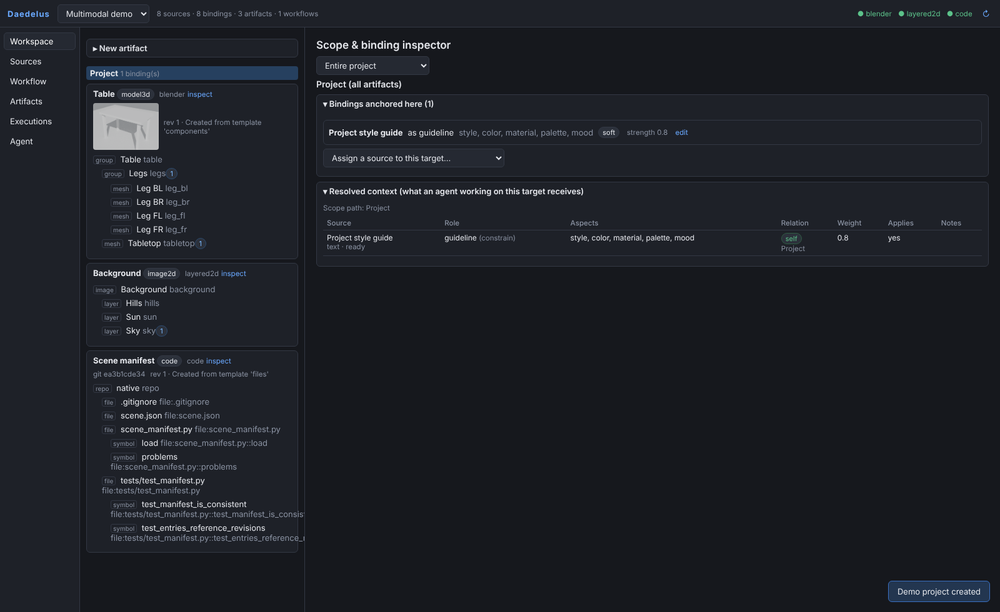 Workspace | 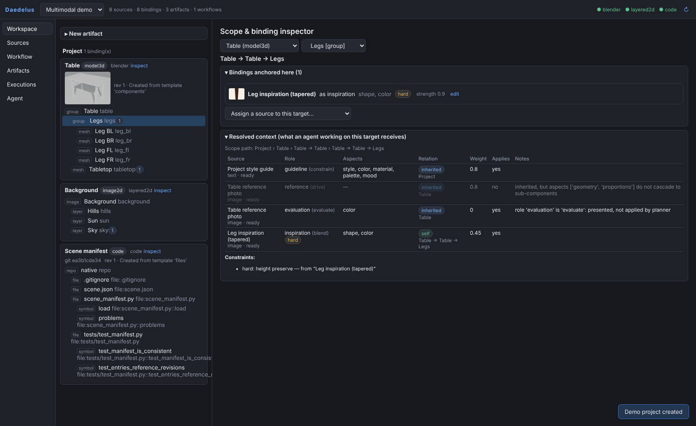 Scope & binding inspector (Table → Legs) |
| 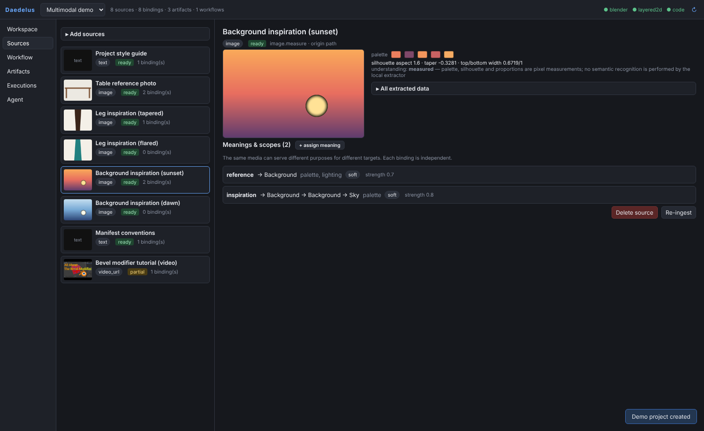 One source, two bindings | 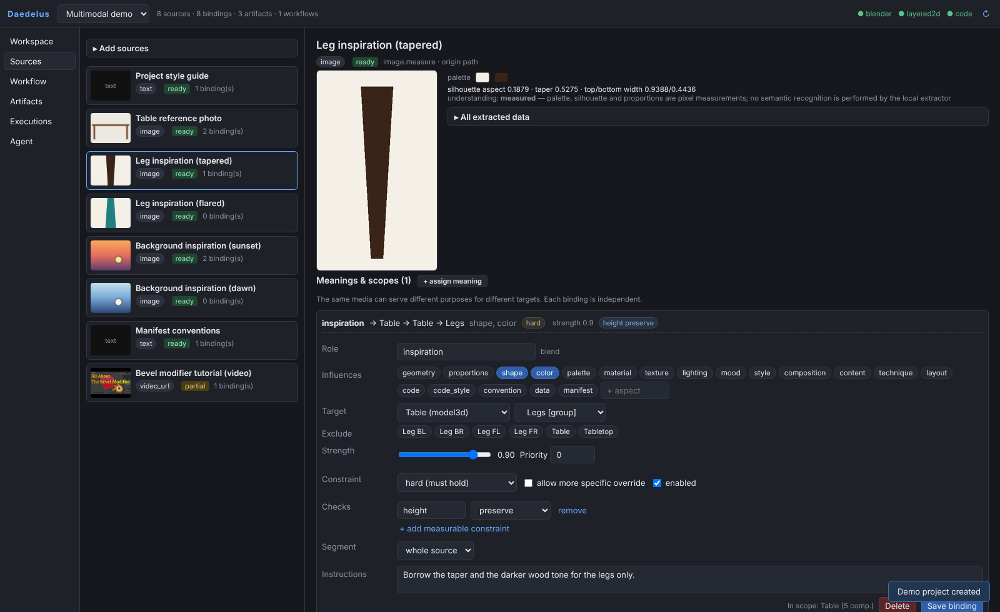 Binding editor |
| 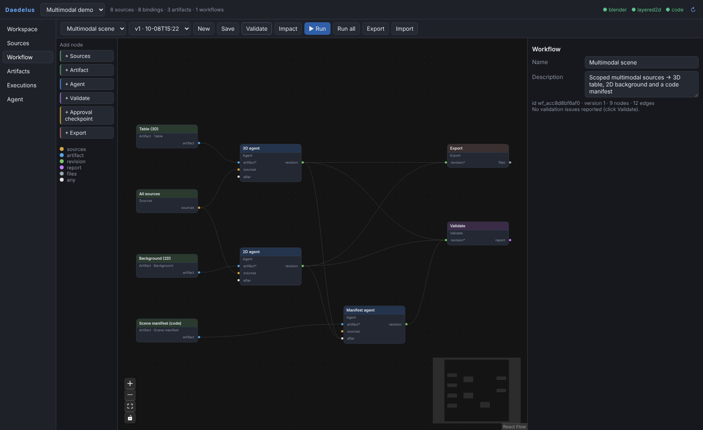 Workflow editor | 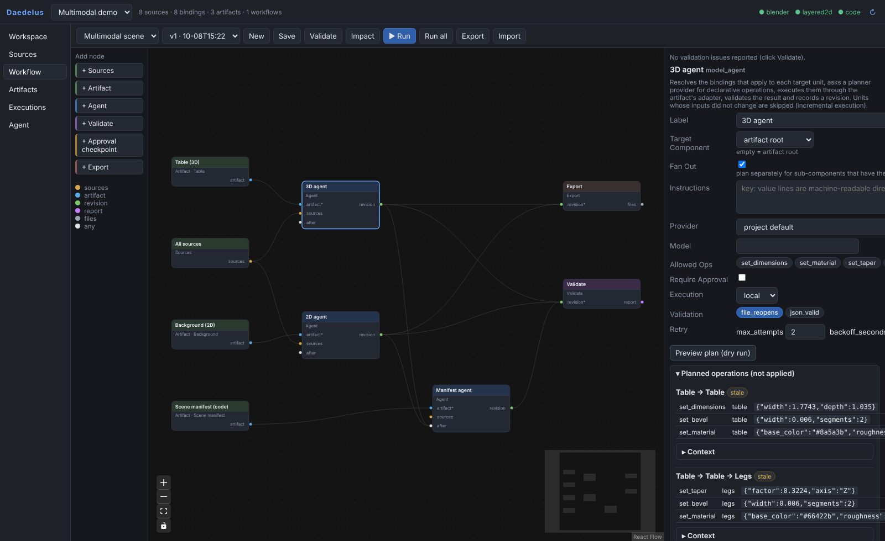 Dry-run plan preview |
| 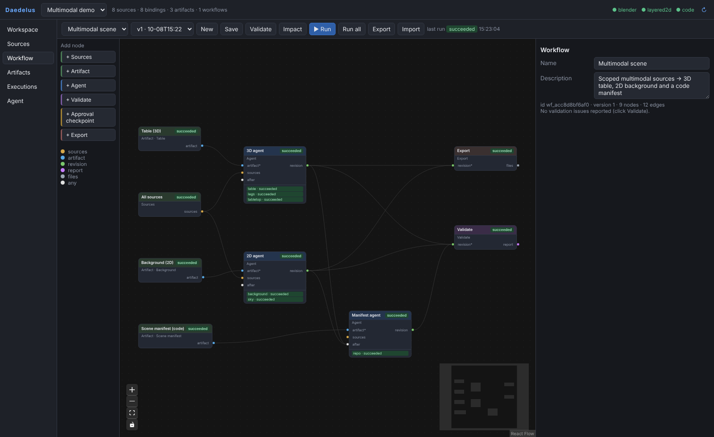 After execution (unit statuses) | 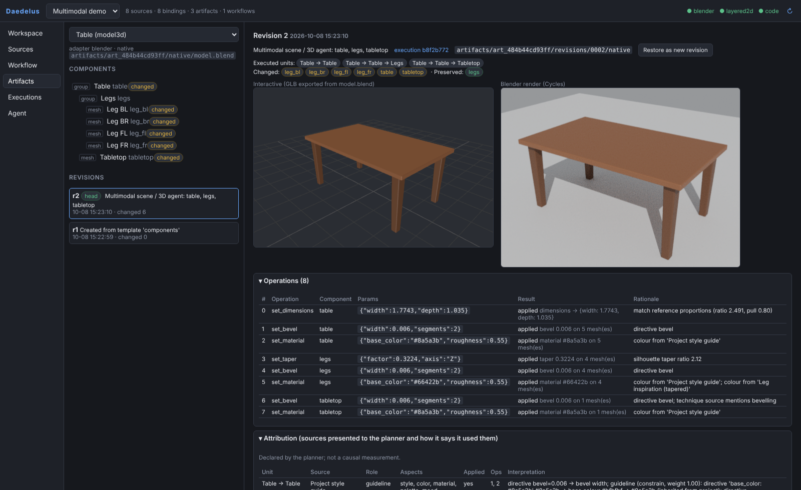 3D artifact: GLB viewer, Cycles render, operations |
| 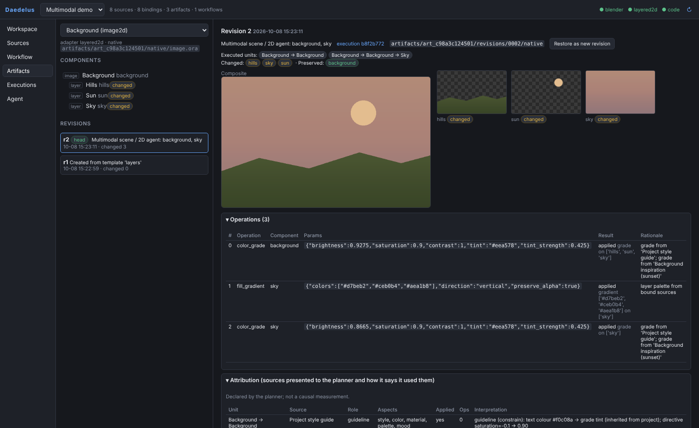 2D artifact: composite + layers | 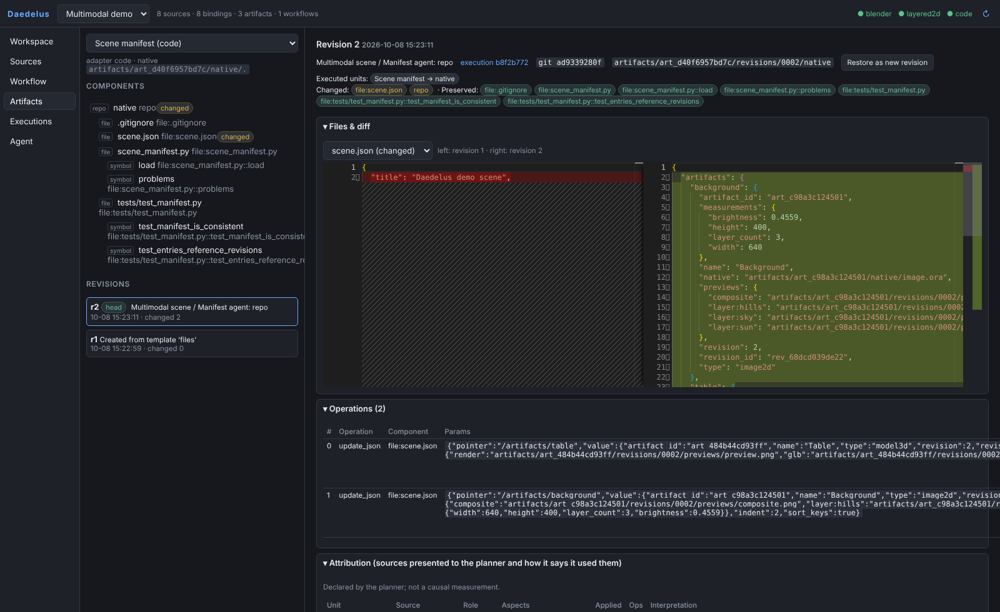 Code artifact: Monaco diff |
| 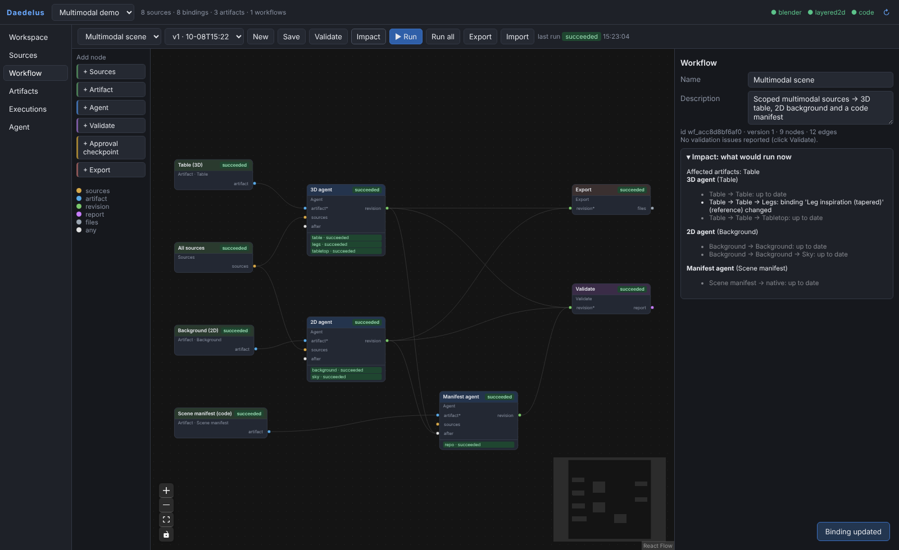 Impact after a role change | 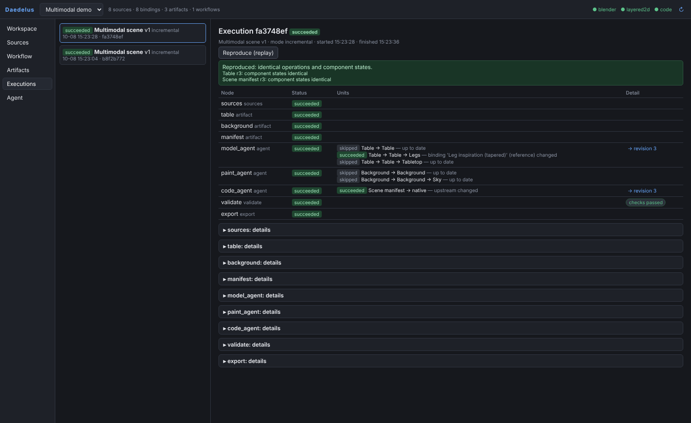 Execution monitor + replay |
| 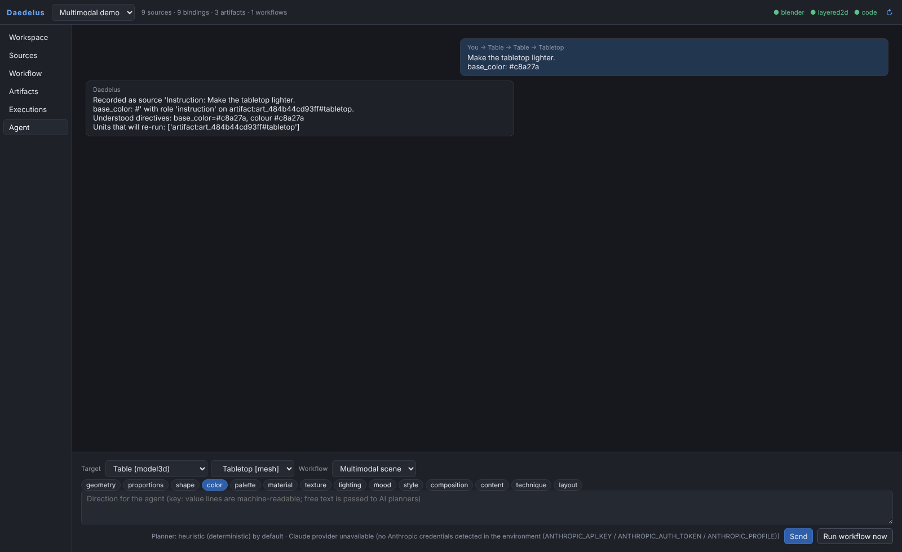 Agent conversation | 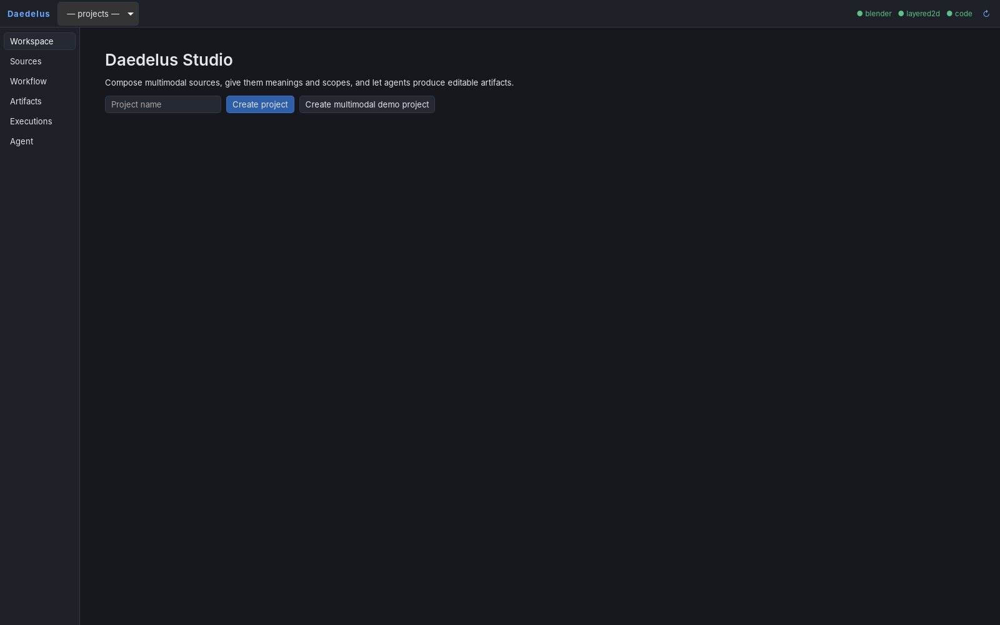 Desktop app (Tauri, Linux/WebKitGTK, sidecar backend) |

## 4. Demonstration inputs and source bindings

Inputs are procedurally generated, controllable fixtures (`evidence/demo/inputs/`) plus one real
YouTube URL. Bindings as created by `daedelus.demo.build_demo` (the scenarios later swap the leg
and sky sources and change one role):

| Source | Media | Role | Aspects | Target | Notes |
|---|---|---|---|---|---|
| Project style guide | text | guideline | style, color, material, palette, mood | Project | `base_color`, `tint`, `roughness`, `bevel`, `saturation` directives |
| Table reference photo | image | reference | geometry, proportions | Table (artifact) | drives proportions |
| Table reference photo | image | evaluation | color | Table (artifact) | same source, second meaning: benchmark used by validation |
| Leg inspiration (tapered) | image | inspiration (hard) | shape, color | Table → Legs | constraint: `height preserve` |
| Background inspiration (sunset) | image | reference | palette, lighting | Background (artifact) | |
| Background inspiration (sunset) | image | inspiration | palette | Background → Sky layer | same source, second binding |
| Manifest conventions | text | guideline | code_style, convention | Scene manifest | `indent`, `sort_keys` |
| Bevel modifier tutorial (`youtube.com/watch?v=vLzY4ApZZcE`) | video URL | technique | technique | Table → Tabletop | title metadata only; content **not** analysed |

The fixtures are data: no engine/adapter/planner code refers to tables, legs or backgrounds.

## 5. Evidence of real artifact modifications

`daedelus demo --out evidence/demo` (report: [evidence/demo/demo_report.md](../evidence/demo/demo_report.md),
40/40 checks) executes and verifies:

| Scenario | Verified |
|---|---|
| S0 initial run | all three artifacts get revision 2; legs height preserved (hard constraint, measured); manifest tests run and pass; reviewable diff; an immediate re-run executes nothing |
| S1 swap the leg source | impact shows only the legs unit stale; only `legs`/`leg_*` component states change; tabletop and table root untouched; background not rebuilt; manifest re-runs because an upstream revision changed |
| S2 swap the sky source | impact shows only the sky unit; table not rebuilt; only the `sky` layer changes |
| S3 edit the global style guide | impact lists **both** Table and Background as affected; both get new revisions |
| S4 role inspiration → reference | source hash unchanged; interpretation switches to `reference (drive)`; only leg components change |
| S5 conflicting hard constraints | 3D agent fails with an explicit conflict; table untouched; downstream nodes `blocked` |
| S6 test command not permitted | validation fails accurately ("not in allowed_commands — not executed") |
| S7 reproduction | replay of three executions reproduces identical operations and component states |
| S8 persistence | project reopens; workflow export/import lossless; saving creates a new version; editable native files exist |

Before/after renders: `evidence/demo/images/` (Cycles renders of the .blend and OpenRaster composites
per stage).

## 6. Editable 2D and 3D output paths

Inside a project directory (`<workspace>/projects/<project_id>/`):

* 3D: `artifacts/<table_id>/native/model.blend` — a regular Blender file: parented objects with
  `daedelus_id` properties, Principled materials `dd_mat_*`, non-destructive `dd_taper` / `dd_bevel`
  modifiers. Each revision is snapshotted to `artifacts/<id>/revisions/NNNN/native/model.blend`
  (+ `previews/preview.png`, `previews/model.glb`).
* 2D: `artifacts/<background_id>/native/image.ora` — OpenRaster (opens in Krita/GIMP/MyPaint), one PNG
  per layer plus `mergedimage.png`; non-destructive grade parameters and base pixels in `daedelus/`.
* Code: `artifacts/<manifest_id>/native/` — a git repository (`git log` shows one commit per
  revision).

## 7. Code/file modification evidence

`evidence/demo/manifest_revision2.diff` is the unified diff of the first manifest revision (the
`update_json` operations recording the table and background revisions). The commit is created by
the code adapter; `tests/test_manifest.py` in the artifact verifies every referenced native file
exists and runs as the `tests` validation check. This is a minimal, real file-modification path —
not a coding IDE.

## 8. Automated test results

* Backend (`backend/tests`, pytest): **57 passed** locally with Blender 4.5.14 LTS (ingestion,
  binding resolution, engine incl. retries/rollback/approvals/conflicts/scope enforcement/replay,
  adapters incl. real Blender, providers incl. Claude provider against a fake client, HTTP API,
  full Section 8 demo).
* Studio unit tests (vitest): 3 passed; TypeScript typecheck + production build pass.
* Studio end-to-end walkthrough (Playwright, real backend + Blender): **15/15** checks
  (`docs/screenshots/e2e_results.json`).
* CI results: all green on Linux and Windows, see §10.

## 9. Validation that still requires native hardware / GUI

* The Windows installer is built and the frozen backend smoke-tested on a Windows runner, but the
  installed desktop app has **not** been launched interactively on Windows (no GUI session).
* Windows runners have no Blender, so the Blender adapter is not exercised on Windows; the Windows test
  run skips Blender tests (reported as skipped, not passed).
* Desktop app verified on Linux under Xvfb/WebKitGTK only (screenshot 15). macOS not built.
* The Three.js viewer was verified in headless Chromium with SwiftShader; not on GPU hardware.
* The Claude provider has not been exercised against the live API.

## 10. Windows build results

Verified on commit `82b7216` (GitHub Actions, all jobs green):

| Workflow / job | Result |
|---|---|
| [CI](https://github.com/maxhightower/Daedelus/actions/runs/37802773969) · Backend tests (Linux, Blender 4.5.14 LTS) + Section 8 demo | success |
| CI · Studio (typecheck, vitest, production build) | success |
| CI · Studio end-to-end (Playwright + backend + Blender) | success |
| [Windows desktop build](https://github.com/maxhightower/Daedelus/actions/runs/37802773706) | success |

Windows job details (artifact `windows-desktop`):

* Core tests on `windows-latest`: 57 collected, 0 failures, 0 errors, **4 skipped** (the Blender
  tests; there is no Blender on the runner).
* PyInstaller sidecar built and smoke-tested: the frozen `daedelus-server.exe` served `/api/health`
  and created a project.
* Tauri bundles: `Daedelus Studio_0.1.0_x64-setup.exe` (NSIS, 43.8 MB) and
  `Daedelus Studio_0.1.0_x64_en-US.msi` (44.6 MB). They are unsigned and have not been installed or
  launched interactively (§9).

## 11. Known limitations

* The heuristic planner is measurement-based (palettes, silhouettes, directives); it does not
  recognise objects or read video content. Its interpretations state exactly what it used.
* Removing a binding does not undo its earlier influence automatically; use "Restore as new revision".
* Units are planned from the artifact *baseline* (state at creation) for idempotence; components added
  later have no baseline and blend from their current state.
* Two `agent` nodes that edit the same artifact see each other's changes as external modifications
  and will re-run each other's units.
* Approval pauses persist in the database, but a backend restart while an execution is `running`
  leaves it marked running (no automatic recovery).
* Video URLs: metadata only; no download or understanding backend. Audio: probe only.
* Code tests in the desktop build require a Python interpreter with pytest on the user's machine
  (reported as a failed check, with the reason, when missing).
* `Apache-2.0` is declared in package metadata as a placeholder; no LICENSE file was added — the
  project owner should choose the license.

## 12. Next milestone recommendations

1. Live Claude planning in CI (secret-scoped) with recorded plan fixtures for regression.
2. A video-understanding extractor (frame captioning / transcript via a provider) behind the existing
   extractor registry, and segment-aware summaries.
3. Semantic image regions (segmentation) so `region` segments map to components.
4. Additional adapters through the same interface: a live DCC-MCP transport for Blender, an image
   generation adapter writing into OpenRaster layers, a Godot/Unity scene adapter.
5. Execution recovery after restarts and a worker queue (local processes first, then remote workers to
   make `execution: cloud` real).
6. Per-binding "revert influence" and branchable revision graphs.
7. Signed Windows installer and an interactive Windows QA pass.
