# Daedelus V1 — Spatial Canvas & Hybrid Artifact Editing: report

Branch `opus/daedelus-v1-spatial-canvas`, based on `opus/daedelus-v0-multimodal-studio` @ `16f0ca1`.
Not merged; no pull request opened. Commit SHA and CI run links: [§9](#9-ci-and-windows-build).

Design and data model: [V1_ARCHITECTURE.md](V1_ARCHITECTURE.md). V0 architecture is unchanged:
[ARCHITECTURE.md](ARCHITECTURE.md).

## 1. Phases (commits)

| Phase | Commit | Content |
|---|---|---|
| 0–1 backend | `cabd762` | board model + persistence, derived connections, idempotent migration, scoped manual-edit service, glTF component ids, office-format previews, board/edit API, 12 tests |
| 1–3 studio | `3824ca5` | three-region shell, React Flow canvas over boards, typed nodes/edges, renderer registry, in-place editing, 3D picking, Focus, contextual inspector, agent dock; V0 panels removed |
| store fix | `56dc3dc` | SQLite rows fetched under the connection lock (real concurrency bug found by the e2e run) |
| 4–5 studio | `55f8111` | placement, frame stacking, port hit-areas, view framing, revision loading; unit tests; walkthrough + perf scripts |
| 6 validation | `791861e` | edges-vanishing fix, live smoke test (opt-in), CI switched to the V1 walkthrough + perf, evidence |
| 7 report | `3e17a7d` + follow-up | keyboard Focus path, this report, final evidence; approval-wait race fixed in the walkthrough |

## 2. What changed in the product

* One workspace: Explorer (left), infinite canvas (centre), contextual Inspector (right),
  collapsible agent dock. The V0 tabbed panels were deleted, not embedded as cards.
* Persistent boards (backend, versioned, optimistic concurrency) with five item categories —
  sources, artifact views, workflow operations, notes, frames/workflow frames — and typed
  connections. Items are views of resources; several views of one artifact are supported.
* Reference and execution connections are derived from bindings and workflow edges, so the
  canvas can never disagree with the domain; dependency and annotation connections are stored
  on the board.
* Hybrid editing: canvas (Level 1), in place (Level 2: double-click / Enter / Edit), Focus
  (Level 3: ⤢ / Shift+Enter) with pinned references; Escape exits one level; Focus restores the
  exact board viewport.
* Native in-place edits through adapters with checkpoint/rollback, scope and constraint checks:
  Blender material/roughness and leg taper, OpenRaster layer opacity/visibility/grade, code
  file edits with diff review and git commit.
* 3D component picking resolves the persistent `daedelus_id` (glTF extras); a source dropped on
  a component creates a real component-scope `SourceBinding`.
* Workflows are operated on the board: add operations, connect ports, configure nodes
  (each saves a new workflow version), validate, impact preview, run, approve; node statuses
  and per-unit results are shown on the operation nodes.
* Zoom-dependent rendering (far/medium/close), lazy mounting, WebGL budget, render-on-demand.
* Layout-only undo/redo, saved views, Fit / Selection framing.
* Spreadsheets, documents and presentations import and preview (view-only).

## 3. Persistence and migration

* Boards live in each project's SQLite database (`docs` table), `schema_version` 1.
* `ensure_boards` builds a default board for projects that have none (Artifacts frame,
  References frame, one frame per workflow with its nodes) and records
  `board_migration_version=1`; repeated runs are no-ops (`test_migration_is_idempotent`).
  Domain data is never modified by migration or by any board edit.
* Stale saves return 409; the studio reloads the stored layout rather than overwriting.
* Evidence: A-scenario checks "positions and sizes persist across reload", "relationships
  persist (derived connections recomputed identically)", "saved board viewport is restored".

## 4. Screenshots (real app, real backend, real Blender)

All in [`docs/screenshots/v1/`](screenshots/v1/), produced by `studio/e2e/spatial.e2e.mjs`.

| | |
|---|---|
| Board overview | 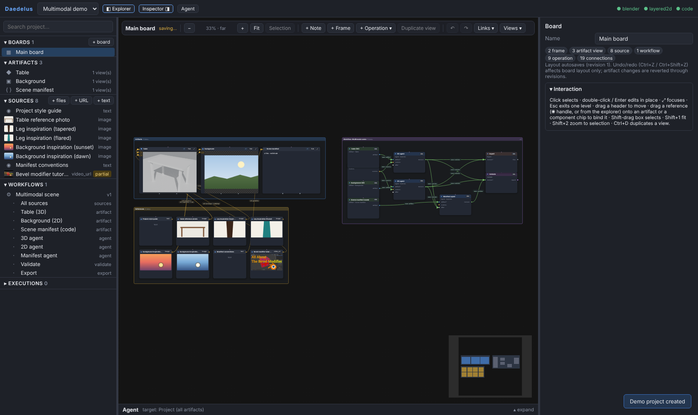 |
| Far level of detail | 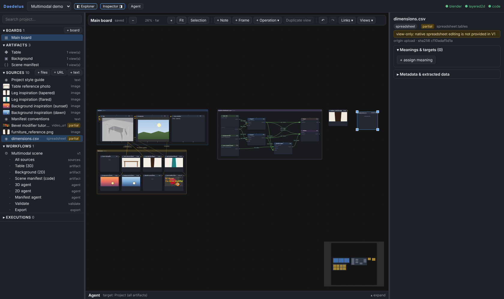 |
| Close level of detail (live 3D) | 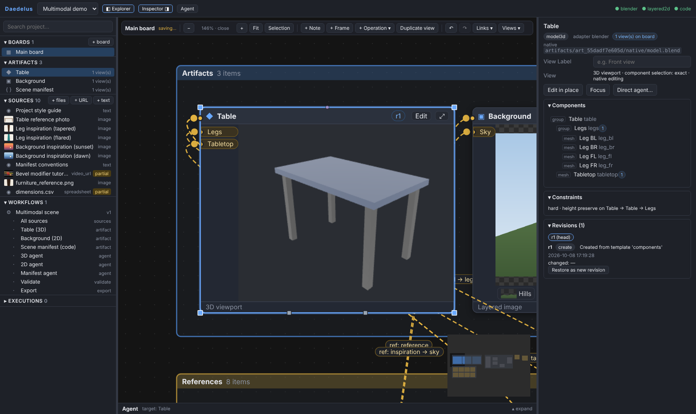 |
| Leg picked in the viewport | 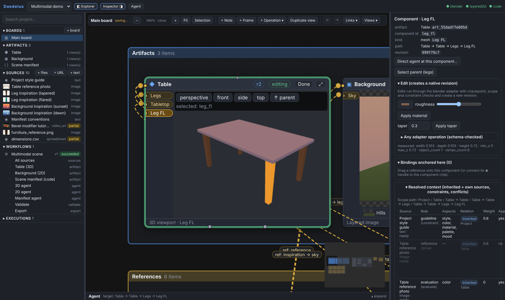 |
| Relationship dialog (source → component) | 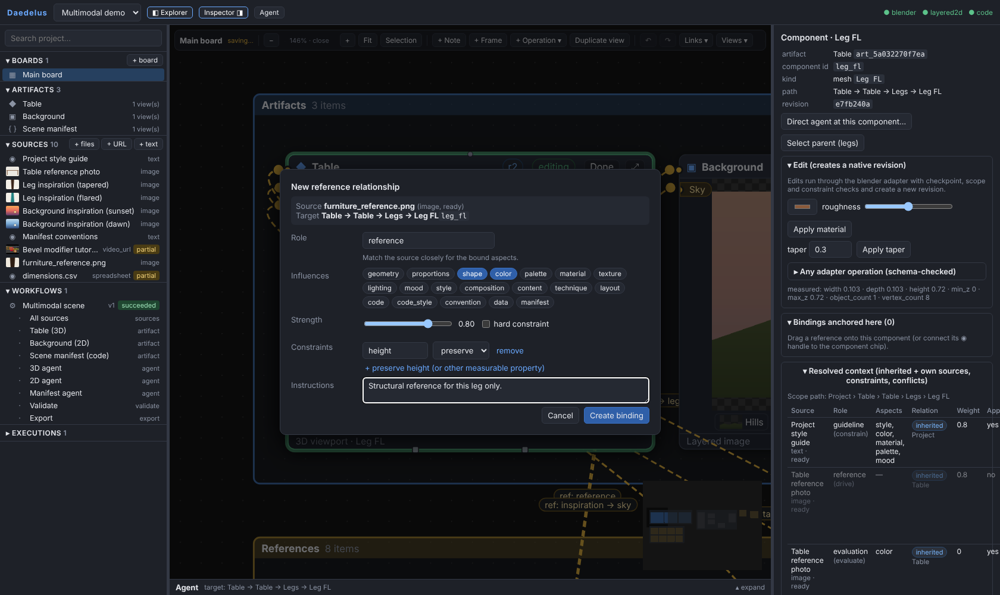 |
| Binding anchored on Leg FL |  |
| Impact preview | 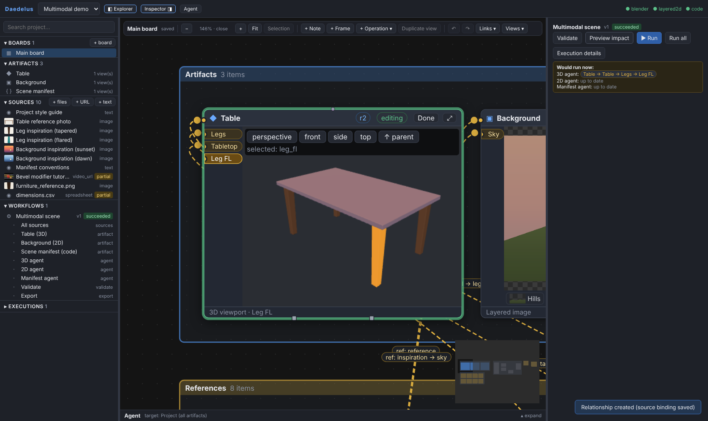 |
| After the incremental run | 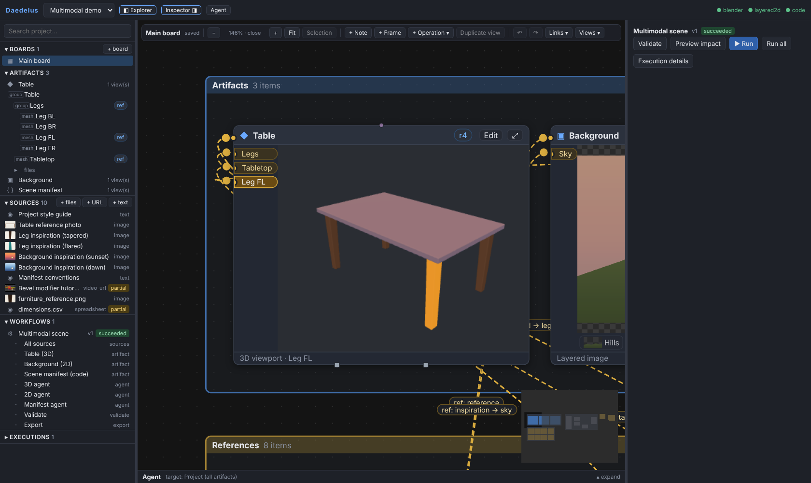 |
| Focus edit with pinned references | 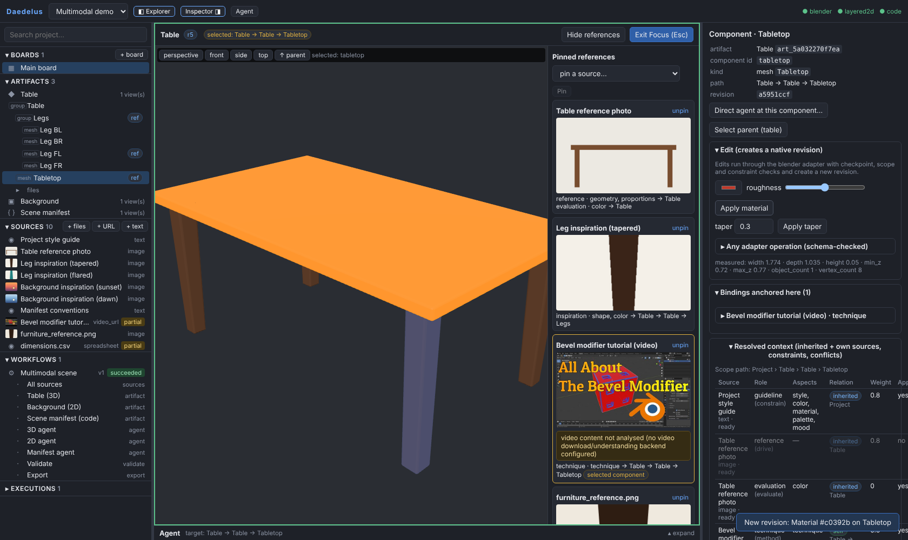 |
| Two views, one artifact | 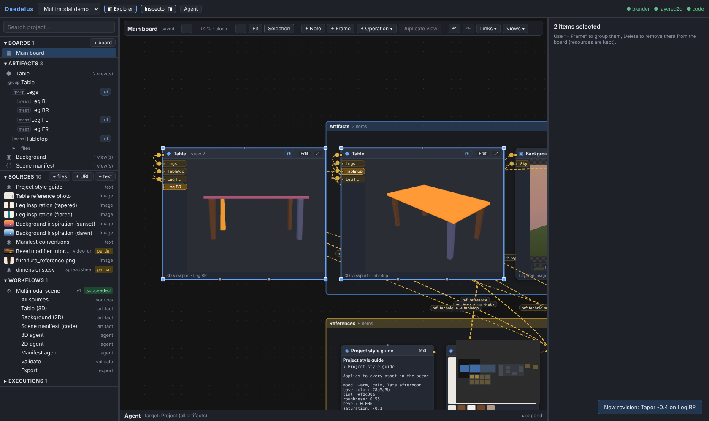 |
| In-place layer edit | 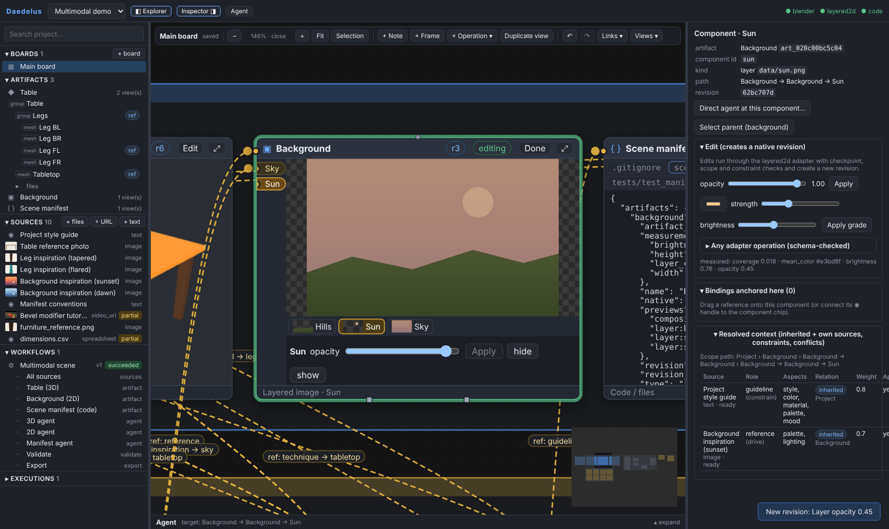 |
| Code diff review | 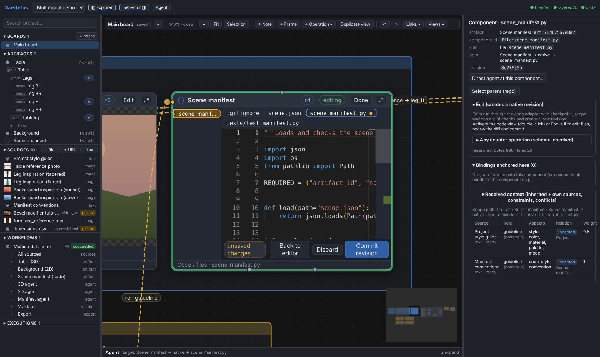 |
| Workflow awaiting approval | 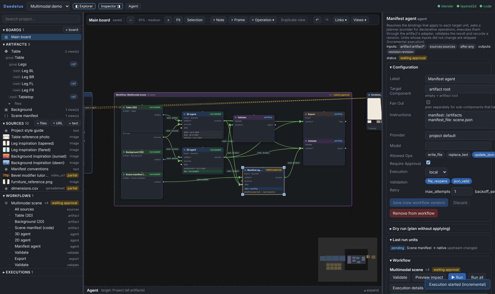 |
| Board after the workflow run | 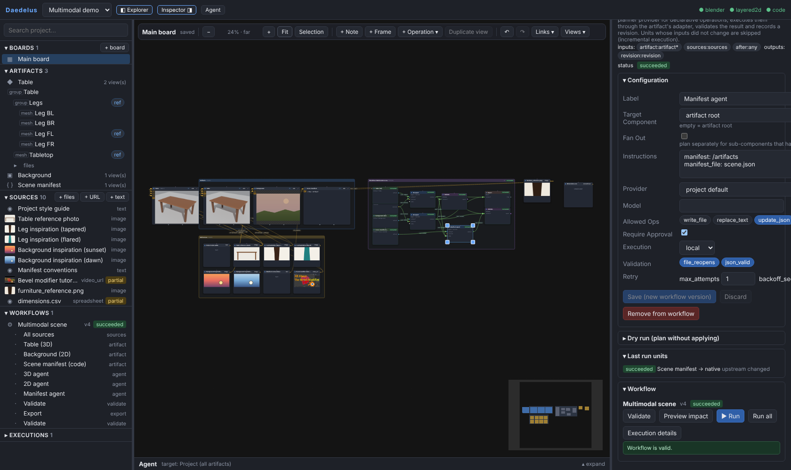 |
| Perf board (fit all / close) | 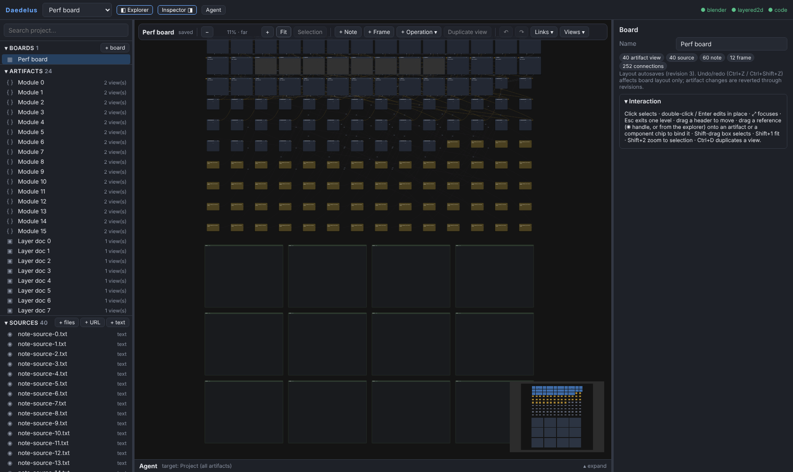 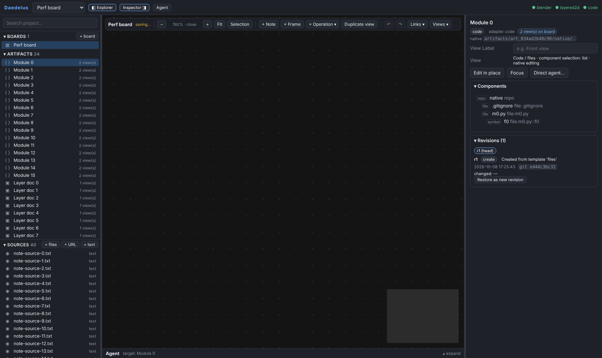 |

## 5. Component selection and binding evidence (scenario B)

Clicking the front-left leg in the live 3D view raycasts to the mesh, walks to the object
carrying `daedelus_id = leg_fl`, selects component `leg_fl`, shows a `Leg FL` chip on the view,
retargets the agent dock, and the Inspector shows its resolved context. Dropping
`furniture_reference.png` on the chip opens the relationship dialog targeted at `Leg FL`;
"Create binding" stores a `SourceBinding` with `target.scope = component`,
`component_id = leg_fl`; the board then shows a derived reference edge to handle
`comp-in:leg_fl`. Impact preview reports only the new `leg_fl` unit of the 3D agent as stale;
the run executes only that unit, skips the 2D agent, leaves the Background head unchanged, and
the new Table revision's `changed_components` is exactly `["leg_fl"]`.

## 6. Native modification evidence (scenarios C, D, E)

* **3D (Blender)**: in Focus, a material edit on `tabletop` created revision `origin: manual`
  with a `.blend` snapshot; validation passed (`file_reopens`, scope preserved). Orbiting a view
  changes only that item's camera and creates no revision. In D, a taper edit on `leg_br` from
  the second view updates both views while each keeps its own camera.
* **2D (OpenRaster)**: layer opacity edit on `sun` — revision changes exactly `["sun"]`, file
  reopens.
* **Code (git)**: Monaco edit → diff review → commit; revision touches only the edited file.

## 7. Workflow results (scenario F)

Adding a Validate operation from the board creates a real node (new version); dragging
`out:revision` → `in:revision` creates a workflow edge (new version) that the board renders as
an execution connection; requiring approval on the manifest agent from the Inspector saves a
new version; Validate passes; the run pauses in `waiting_approval` (visible on the node), is
approved, and succeeds. After a settle run (the manual edits in C–E legitimately invalidated
those units), changing the sky binding re-runs only `paint_agent:sky` (background skipped,
3D agent up to date), the new Validate node runs, and no board item moves.

## 8. Tests

| Suite | Result |
|---|---|
| Backend pytest (Linux, real Blender 4.5.14) | 69 passed, 1 skipped (live Claude, see below) — V0's 57 + V1's 12 |
| V0 demonstration (`daedelus demo`) | 40/40 checks ([evidence](../evidence/v1/v0_demo_regression_report.md)) |
| Studio unit tests (vitest) | 11 passed (3 V0 + 8 canvas: node mapping, frame stacking, placement, LOD) |
| Spatial walkthrough (`e2e/spatial.e2e.mjs`, scenarios A–F + undo + keyboard) | **60/60 checks passed** ([results](../evidence/v1/spatial_e2e_results.json), [log](../evidence/v1/spatial_e2e_run.log)) |
| Board performance (`e2e/perf.e2e.mjs`) | completed, see §10 |
| Live Claude smoke test (`tests/test_live_claude.py`) | **blocked** — no Anthropic credentials in this environment; the test reports `skipped: live Claude smoke test blocked: no Anthropic credentials detected…`. Not counted as passed. |

The V0 browser walkthrough (`studio.e2e.mjs`) was removed because the UI it drove no longer
exists; its coverage (sources, bindings, workflow editing, runs, approvals, agent) is exercised
by the spatial walkthrough on the new UI.

Bugs found by the walkthrough and fixed (each reproduced first):
SQLite rows read outside the connection lock (intermittent `None` documents under concurrent
autosave + polling); edges disappearing after a selection change (node rebuild dropped React
Flow's measurements, so handle bounds were lost and never re-measured); selected frames lifted
above their own children by React Flow's selection elevation; operation ports clipped by the
node box; new operations placed on top of existing nodes; resize handle under the minimap
(test); scope-path labels repeated in the Inspector.

## 9. CI and Windows build

All runs: <https://github.com/maxhightower/Daedelus/actions?query=branch%3Aopus%2Fdaedelus-v1-spatial-canvas>.

| Commit | CI (Linux) | Windows desktop build |
|---|---|---|
| `791861e` | [success](https://github.com/maxhightower/Daedelus/actions/runs/37816032323): backend pytest with Blender, demo 40/40, studio typecheck/tests/build, spatial walkthrough 58/58, perf run complete | superseded by the next push |
| `3e17a7d` | [failure](https://github.com/maxhightower/Daedelus/actions/runs/37816630541): walkthrough 58/60 — the test read an execution right after clicking Approve, before the asynchronous decision was applied (CI is faster than the dev container); fixed in the next commit by waiting past `waiting_approval` | [success](https://github.com/maxhightower/Daedelus/actions/runs/37816630490) |
| head | see the hand-off message for the final head's runs | |

On CI the perf script measured the same shape as locally (152 items / 252 connections; 0 long
tasks while panning; 1–3 long tasks of ≤ 73 ms in the zoom cycle; release → saved ≈ 595 ms).

The Windows job builds the frozen backend sidecar and the Tauri NSIS/MSI installers and runs
the core tests on Windows. **The installers were built, not installed**: no manual installation
test was performed.

## 10. Performance (real measurements)

Board: **152 items** (40 artifact views incl. 16 second views, 40 sources, 60 notes, 12 frames)
and **252 connections** (200 stored dependency/annotation + 52 derived reference connections
from 30 bindings). Raw data: [`evidence/v1/perf_results.json`](../evidence/v1/perf_results.json).

| Measurement | Result |
|---|---|
| select project → board rendered and saved-state idle | 1,281 ms |
| Fit all (11 %, far LOD) | 152 nodes, 252 edges, 3,464 DOM elements, JS heap 36 MB |
| Pan at far LOD (4 drags, 2.1 s) | 0 long tasks; rAF interval p95 16.7 ms, max 16.8 ms |
| Zoom cycle across all LOD levels (50 wheel steps, 2.7 s) | 2 long tasks (61 ms max, 115 ms total); rAF max 50 ms |
| Zoomed to one view (192 %, close LOD) | 4 nodes mounted, 1,037 DOM elements |
| Pan at close LOD (4 drags) | 0 long tasks; nodes mount/unmount as they enter/leave |
| Drag a node → autosaved | gesture 946 ms (10 mouse steps); release → saved 568 ms (incl. 500 ms debounce) |
| Board save payload | 111 KB |

Lazy mounting is what keeps close-up work cheap: at close zoom the DOM falls from ~3,460 to
~650–1,040 elements. The only long tasks measured are during LOD transitions in the zoom cycle,
when many node bodies switch representation at once.

Environment caveat: headless Chromium with SwiftShader software GL and no GPU, in a shared
container. `requestAnimationFrame` is vsync-paced in headless mode, so frame intervals hide
main-thread cost; Long Tasks (> 50 ms) are therefore reported as the jank signal. The perf
board has no live 3D views (those are capped separately by the WebGL budget of 6). No FPS
figure for a real desktop GPU is claimed.

## 11. Known failures and limitations

* Live Claude planning is **not verified** in V1 (blocked: no credentials). The agent dock
  works with the deterministic heuristic planner.
* Office formats are preview-only (`partial`); no spreadsheet/document/presentation editing.
* Revision sync uses a 3 s poll, not push; a second client's edits appear within that window.
* Concurrent board edits from two clients: the second save gets 409 and reloads (no merge).
* Undo/redo history is per session (not persisted) and layout-only by design.
* Saved views can be created and applied; there is no rename/delete UI yet, and saved views
  are not covered by the automated walkthrough.
* At most 6 live WebGL viewports; further 3D views show the static render until a slot frees.
* Monaco is the largest bundle chunk (≈2.3 MB, lazy-loaded).
* The Windows installer is built in CI only; not manually installed or run.
* The walkthrough takes ≈12 min (real Blender runs) and runs in CI on every push.

## 12. Recommendations

1. Push revision/execution updates over SSE or WebSocket instead of polling.
2. Add saved-view management and include it in the walkthrough.
3. Run the live Claude smoke test with real credentials (`DAEDELUS_LIVE_CLAUDE=1`) before
   relying on Claude-planned edits from the dock.
4. Measure the board on a real desktop GPU (Windows build) with several live 3D views.
5. Field-level merge for concurrent board edits if multi-user use is planned.
6. Choose and add the project's open-source license (deliberately not added without the
   owner's decision).
